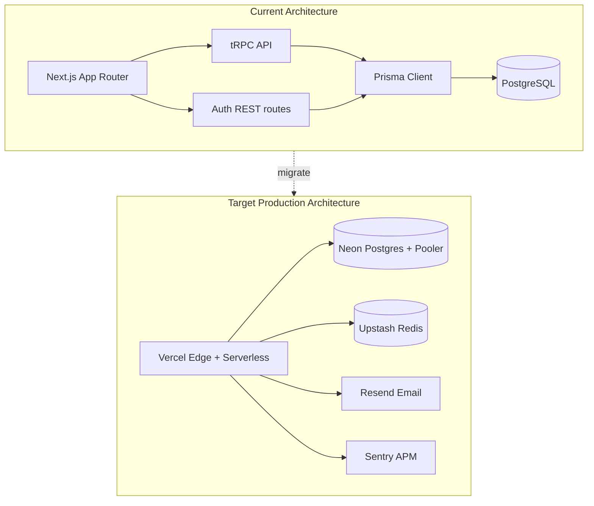
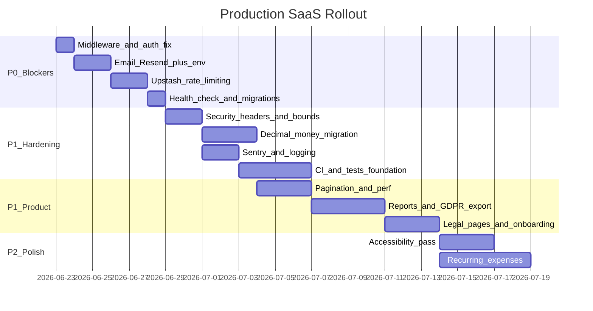

# Expense-Tracker Production SaaS Roadmap

## Current State Assessment

The app is a **well-structured Next.js 16 monolith** with real business logic already implemented:

| Layer | Status |
|-------|--------|
| Core features | Dashboard, expenses, budgets, splits, loans, persons, categories, profile |
| Auth | NextAuth (credentials + optional Google), email verification, OTP 2FA |
| API | tRPC routers → services → Prisma, Zod validation, user-scoped queries |
| UI | Custom Tailwind design system, dark mode, PWA, responsive shell |
| Data | PostgreSQL via Prisma with 5 migrations and sensible indexes |

**Critical gaps for public SaaS launch:**

1. **Auth middleware is not active** — [`proxy.ts`](proxy.ts) exists but Next.js requires [`middleware.ts`](middleware.ts) at the project root. Protected pages are currently reachable without a session (API is guarded; UI is not).
2. **Email silently no-ops** — [`server/auth/email.ts`](server/auth/email.ts) returns without error when SMTP is unset; signup/OTP/verification appear to succeed but no mail is sent.
3. **No CI/CD, tests, observability, or deploy runbook**
4. **In-memory rate limiting** — [`server/middleware/rateLimit.ts`](server/middleware/rateLimit.ts) breaks on Vercel serverless (per-instance, resets on cold start)
5. **Float money types** — [`prisma/schema.prisma`](prisma/schema.prisma) uses `Float` for all amounts (rounding risk in a finance app)
6. **Scale limits** — expense list hard-capped at 100/month; loans load all transactions; no reports/export



---

## Recommended Production Stack (chosen for SaaS on Vercel)

| Concern | Production choice | Why |
|---------|-------------------|-----|
| Hosting | **Vercel** (user preference) | Native Next.js 16, preview deploys, edge middleware |
| Database | **Neon Postgres** + Prisma connection pooler (`?pgbouncer=true`) | Serverless-friendly pooling, branching for staging |
| Rate limiting | **Upstash Redis** via `@upstash/ratelimit` | Distributed, works across serverless instances |
| Email | **Resend** (primary) + SMTP fallback | Already in [`.env.example`](.env.example); reliable transactional delivery for SaaS |
| Error tracking | **Sentry** (`@sentry/nextjs`) | Industry standard for Next.js SaaS |
| Env validation | **`@t3-oss/env-nextjs`** | Fail fast at build/runtime on missing secrets |
| Tests | **Vitest** (unit/integration) + **Playwright** (E2E) | Fast calc/service tests + auth flow coverage |
| CI | **GitHub Actions** | Lint, typecheck, test, build, migration validate |
| Staging | **Vercel Preview + Neon branch** | Per-PR isolated DB |

**Not recommended for v1:** Capacitor/native wrappers, full i18n, self-hosted Docker — defer until web SaaS is stable.

---

## Phase 0 — Launch Blockers (P0)

Must complete before any public users.

### 0.1 Fix route protection

- Rename or re-export [`proxy.ts`](proxy.ts) as **`middleware.ts`** (Next.js convention).
- Add `/profile/:path*` to the matcher (currently missing).
- Add redirect to `/login` for unauthenticated access on all `(main)` routes.

### 0.2 Fix email delivery (fail-loud in production)

Refactor [`server/auth/email.ts`](server/auth/email.ts):

```ts
// Priority: Resend → SMTP → throw in production / log in development
if (process.env.NODE_ENV === "production" && !hasEmailProvider) {
  throw new Error("Email provider not configured");
}
```

- Wire **Resend** using `RESEND_API_KEY` from [`.env.example`](.env.example).
- Remove or clearly deprecate unused `sendEmailViaGmailAPI` (or integrate as tertiary fallback).
- Add `EMAIL_PROVIDER=resend|smtp` env for explicit operator control.

### 0.3 Env validation at startup

Create `env.mjs` with `@t3-oss/env-nextjs` validating:

- `DATABASE_URL`, `NEXTAUTH_SECRET`, `NEXTAUTH_URL`
- `RESEND_API_KEY` or full SMTP config (required in production)
- `UPSTASH_REDIS_REST_URL` + `UPSTASH_REDIS_REST_TOKEN` (required in production)
- Optional: `GOOGLE_CLIENT_ID` / `GOOGLE_CLIENT_SECRET` pair

Import in [`next.config.mjs`](next.config.mjs) and tRPC context so misconfiguration fails at build, not at first signup.

### 0.4 Distributed rate limiting

Replace in-memory store in [`server/middleware/rateLimit.ts`](server/middleware/rateLimit.ts) with **Upstash Redis**:

- Auth routes: keep existing per-IP/per-email scopes from [`server/config/rateLimit.ts`](server/config/rateLimit.ts)
- Add tRPC middleware rate limit on mutations (`create`, `delete`, `upsert`) — e.g. 60 req/min per user
- Add signup CAPTCHA consideration: **Cloudflare Turnstile** on `/api/register` and `/api/auth/login/start` (low friction, bot-resistant for SaaS)

### 0.5 Production database workflow

Add scripts to [`package.json`](package.json):

```json
"db:migrate:deploy": "prisma migrate deploy",
"db:migrate:status": "prisma migrate status"
```

- Document in deploy runbook: run `prisma migrate deploy` in CI **before** or as part of Vercel deploy (via GitHub Action, not postinstall — safer).
- Enable **Neon automated backups** + document restore procedure.

### 0.6 Health check endpoint

Add `app/api/health/route.ts`:

- `GET` returns `{ status: "ok", db: "ok" }` after `prisma.$queryRaw\`SELECT 1\``
- Used by Vercel monitoring / uptime checks (Better Uptime, Checkly)

---

## Phase 1 — Security Hardening (P0/P1 for SaaS)

### 1.1 Security headers

Extend [`next.config.mjs`](next.config.mjs) with `headers()`:

- `Strict-Transport-Security` (max-age, includeSubDomains)
- `X-Frame-Options: DENY`
- `X-Content-Type-Options: nosniff`
- `Referrer-Policy: strict-origin-when-cross-origin`
- `Permissions-Policy` (camera, microphone off)
- **Content-Security-Policy** — start permissive for Next.js/Recharts, tighten iteratively

### 1.2 Input bounds and sanitization

In all tRPC routers ([`server/routers/*.ts`](server/routers/)):

- `note`: `z.string().max(500).optional().nullable()`
- `name` fields: `z.string().min(1).max(100)`
- Remove `.passthrough()` on expense list input in [`server/routers/expense.ts`](server/routers/expense.ts)
- Profile image: keep 300KB limit but **move to object storage** (Vercel Blob or S3) instead of storing base64 in Postgres — critical for SaaS scale

### 1.3 Session optimization

In [`server/auth/authOptions.ts`](server/auth/authOptions.ts):

- Remove per-request DB lookup in `session` callback if possible — store `otpEnabled` / `emailVerified` in JWT at sign-in and refresh on profile update only
- Set explicit session `maxAge` and rotation policy for SaaS

### 1.4 Money precision migration

Migrate Prisma amounts from `Float` to `Decimal @db.Decimal(12, 2)`:

- `Expense.amount`, `ExpenseSplit.amount`, `Budget.amount`, `Loan.totalAmount`, `LoanTransaction.amount`
- Update [`lib/calculations/*.ts`](lib/calculations/) and services to use `Prisma.Decimal` or integer cents internally
- Write a data migration script to round existing floats safely
- This is **non-negotiable** for a finance SaaS

### 1.5 Referential integrity UX

- Category delete: check for linked expenses/budgets in [`server/services/category.service.ts`](server/services/category.service.ts) → `CONFLICT` with actionable message (or soft-delete)
- Person delete: same pattern for splits/loans

---

## Phase 2 — Observability and Operations (P1)

### 2.1 Structured logging

- Add **pino** (or `next-logger`) with JSON output in production
- Log: auth failures, rate-limit hits, email send results, account deletions
- Include `requestId` / `userId` correlation (middleware-generated UUID)

### 2.2 Sentry integration

- `@sentry/nextjs` in app layout, API routes, tRPC `onError` formatter
- Scrub PII (email, tokens) from breadcrumbs
- Alert on error rate spikes

### 2.3 Audit trail (SaaS compliance)

New Prisma model `AuditLog`:

```
userId, action, resource, metadata (JSON), ip, createdAt
```

Log: password change, email change, OTP toggle, account delete, data export.

### 2.4 Background jobs

Add **Vercel Cron** (`vercel.json`):

- Daily: purge expired `EmailVerificationToken` and `LoginOtpChallenge` rows
- Weekly: optional inactive-account notice (future)

### 2.5 Staging environment

- Vercel Preview deployments per PR
- Neon database branch per preview (or shared staging DB with seed data)
- Separate env vars in Vercel project settings (Production / Preview / Development)

---

## Phase 3 — Reliability and Error UX (P1)

### 3.1 Error boundaries

Add App Router files:

- `app/error.tsx` — global fallback with retry
- `app/(main)/error.tsx` — authenticated shell error
- `app/(auth)/error.tsx` — auth flow errors

### 3.2 tRPC error formatter

In [`server/trpc.ts`](server/trpc.ts), add `errorFormatter` that:

- Returns safe messages to client in production (`"Something went wrong"`)
- Logs full error server-side
- Maps `TRPCError` codes consistently

### 3.3 React Query global handler

In [`lib/trpc.tsx`](lib/trpc.tsx):

- `QueryClient` `onError` → toast for mutations, Sentry for 5xx
- Add retry policy for transient network failures

### 3.4 Improve `ErrorState`

[`components/ErrorState.tsx`](components/ErrorState.tsx) — add retry button wired to `refetch()`.

---

## Phase 4 — Performance and Scale (P1/P2)

### 4.1 Pagination (required for SaaS)

| Surface | Current | Target |
|---------|---------|--------|
| Expenses | `take: 100`, no cursor UI | Infinite scroll or "Load more" using existing `nextCursor` in [`server/services/expense.service.ts`](server/services/expense.service.ts) |
| Loans | All transactions embedded | Paginate transactions; lazy-load per loan |
| Categories/Persons | Unbounded | Soft cap warning at 200; paginate if exceeded |
| Dashboard | 13+ parallel DB calls | Consolidate into 2-3 optimized queries or a single `dashboard.getSnapshot` procedure |

### 4.2 Caching strategy

- React Query: tune `staleTime` per procedure (dashboard 60s, lists 30s)
- Consider `unstable_cache` for dashboard aggregates with `revalidateTag` on mutations
- No full-page SSR for data-heavy views — keep client-fetched via tRPC (current pattern is fine)

### 4.3 PWA cache busting

[`public/sw.js`](public/sw.js) — automate `CACHE_NAME` versioning tied to build ID (env injection at build time) to prevent stale UI after deploys.

### 4.4 Image storage

Move profile avatars from DB text to **Vercel Blob** — reduces row size, speeds profile queries, enables CDN delivery.

---

## Phase 5 — Product Completeness for SaaS (P1/P2)

Features users expect from a production finance app:

### 5.1 Reports and data portability (GDPR)

New `/reports` page:

- Monthly/yearly spending summary
- Category breakdown (wire up unused `dashboard.trend` / `dashboard.byCategory` or replace with dedicated report procedures)
- **CSV export** for expenses, budgets, loans (client-side generation from tRPC data)
- **Account data export** (JSON bundle) — GDPR Article 20 portability
- Account delete already exists in [`server/services/profile.service.ts`](server/services/profile.service.ts) — document retention policy (immediate purge)

### 5.2 Legal pages

Static routes (required for public SaaS):

- `/privacy` — data collected, cookies (NextAuth session), third parties (Google OAuth, Resend, Sentry)
- `/terms` — acceptable use, liability
- Cookie/session notice banner (minimal — session-only, no analytics cookies in v1)

### 5.3 Onboarding

Post-signup flow after email verification:

- Set display name, optional default currency
- Seed default categories (Food, Transport, etc.) via new `onboarding.complete` procedure
- Reduces empty-state churn for SaaS

### 5.4 User preferences (foundation for i18n)

Extend `User` model:

```
defaultCurrency String @default("USD")
locale String @default("en-US")
timezone String @default("UTC")
```

Wire through [`lib/formatting/currency.ts`](lib/formatting/currency.ts) and [`lib/formatting/date.ts`](lib/formatting/date.ts). Full i18n (`next-intl`) deferred to v2.

### 5.5 Recurring expenses

Currently only **recurring budgets** exist ([`server/services/budget.service.ts`](server/services/budget.service.ts)). Add:

- `RecurringExpense` model (amount, category, cadence, nextRunDate)
- Vercel Cron job to materialize expenses on schedule

### 5.6 Notifications (optional v1.1)

- Email digest (weekly spend summary) via Resend
- Budget threshold alerts (80%/100% of budget)

---

## Phase 6 — Quality Engineering (P1)

### 6.1 Test pyramid

```
tests/
  unit/           # lib/calculations/*, password validation, rate limit keys
  integration/    # service layer with test DB (Prisma + vitest)
  e2e/            # Playwright: signup → verify → login → create expense → delete
```

**Priority test targets** (highest ROI):

- [`lib/calculations/split.ts`](lib/calculations/split.ts) — `equalSplitParts` cent remainder logic
- [`lib/calculations/budget.ts`](lib/calculations/budget.ts), [`loan.ts`](lib/calculations/loan.ts)
- [`server/services/split.service.ts`](server/services/split.service.ts) — sum validation
- Auth flows: register, verify-email, login with OTP
- tRPC authorization: user A cannot access user B's expenses

### 6.2 CI pipeline (`.github/workflows/ci.yml`)

```yaml
on: [push, pull_request]
jobs:
  ci:
    - npm ci
    - prisma validate
    - npm run lint
    - npx tsc --noEmit
    - npm run test
    - npm run build
```

Separate **deploy workflow** on `main`:

- `prisma migrate deploy` against production Neon
- Vercel auto-deploy (or `vercel deploy --prod`)

### 6.3 Dependabot

Enable `.github/dependabot.yml` for npm + GitHub Actions weekly updates.

---

## Phase 7 — Accessibility and Polish (P2)

- **Modal focus trap** + `aria-labelledby` in [`components/ui/Modal.tsx`](components/ui/Modal.tsx)
- **FilterField** label association in [`components/ui/FilterBar.tsx`](components/ui/FilterBar.tsx)
- Skip-to-content link in [`components/AppShell.tsx`](components/AppShell.tsx)
- Chart text alternatives (summary table below Recharts in [`components/Charts.tsx`](components/Charts.tsx))
- Show PWA install button on mobile (remove `hidden sm:inline-flex` in [`components/PWAInstallButton.tsx`](components/PWAInstallButton.tsx))
- Run **axe** or **eslint-plugin-jsx-a11y** in CI

---

## Phase 8 — Code Cleanup (ongoing)

Remove or wire dead code identified in audit:

| Item | Action |
|------|--------|
| [`components/SplitForm.tsx`](components/SplitForm.tsx) | Delete or integrate |
| [`components/ui/DataTable.tsx`](components/ui/DataTable.tsx) | Use in list pages or delete |
| [`components/ui/Form.tsx`](components/ui/Form.tsx) | Adopt in forms or delete |
| `expense.createWithSplits` | Remove if `split.setExpenseSplits` is canonical |
| Unused `dashboard.trend`, `loan.balance` | Wire to UI or remove |

---

## Suggested Implementation Order



**Estimated timeline:** ~4-6 weeks for P0+P1 (launchable SaaS MVP), +2-3 weeks for P2 product features.

---

## Vercel Deploy Checklist (runbook summary)

1. Create Neon project → copy pooled `DATABASE_URL`
2. Create Upstash Redis → copy REST URL/token
3. Create Resend account → verify domain → copy API key
4. Create Sentry project → copy DSN
5. Vercel project: link repo, set all env vars for Production + Preview
6. GitHub Actions: `prisma migrate deploy` on main before/at deploy
7. Verify: health endpoint, signup email delivery, rate limit 429, protected routes redirect
8. Enable Neon backups; configure uptime monitor on `/api/health`

---

## What NOT to do in v1

- **Do not** static-export or remove server dependencies (documented in [CROSS_PLATFORM.md](CROSS_PLATFORM.md))
- **Do not** add Capacitor/Tauri until web SaaS is live and stable
- **Do not** build full i18n before user locale preferences exist
- **Do not** self-host SMTP on Vercel — use Resend
- **Do not** skip Decimal migration — float rounding will cause user trust issues
